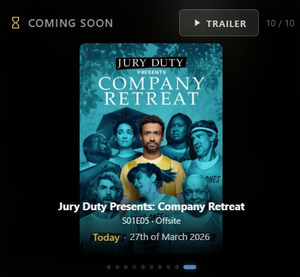

# Coming Soon Card

<p align="center">
  <a href="https://buymeacoffee.com/rusty4" target="_blank">
    
  </a>
</p>


A cinematic Home Assistant card that displays upcoming movies and TV episodes from **Radarr/Sonarr** and/or **Trakt**. Multiple layout options, themes, countdown timers, swipe navigation, and trailer playback.

<p align="center">
  
</p>

## Features

- **Multiple data sources** — Radarr + Sonarr, Trakt, or both combined
- **Upcoming movies** with digital release dates
- **Upcoming TV episodes** with air dates and season/episode numbers
- **Days offset** — optionally include items released up to N days ago
- **Themes** — 9 colour presets including Plex, Kodi, Jellyfin, Emby, Midnight, Sunset, Forest
- **Multiple layouts** — centred poster or detailed view with poster + info side-by-side
- **Image type toggle** — choose between poster art or key art/fanart
- **Countdown timer** — "In 5 days", "Tomorrow", "Today"
- **Formatted release date** — "8th of April 2026"
- **Swipe navigation** — swipe or click-and-drag left/right to move through items
- **Blurred background art** — cinematic fanart behind the card content
- **Trailer button** — plays trailers via TMDB (optional, requires free API key)
- **Trailer mode** — play inline on the card or as a fullscreen popup
- **Auto-cycling** — rotates through upcoming items with smooth transitions
- **Color-coded dots** — primary accent for movies, secondary for TV
- **Visual editor** — configure everything from the HA UI, no YAML needed
- **Responsive** — poster scales to fit any card width
- **Filters past releases** — only shows items not yet downloaded
- **Deduplicates TV shows** — only shows the next upcoming episode per series

---

## Layouts

### Poster (centred)
The default layout — poster front and centre with title, countdown, and release date overlaid at the bottom.

<p align="center">
  
</p>

### Detailed (poster + info)
Poster on the left with full details on the right — title, episode info, countdown, release date, and synopsis.

<p align="center">
  
</p>

### Key Art / Fanart
Switch from portrait poster art to landscape key art/fanart for a more cinematic look.

<p align="center">
  
</p>

### Detailed + Key Art
Combine detailed layout with fanart for a full info view with landscape key art.

<p align="center">
  
</p>

---

## Install via HACS (Recommended)

1. Open **HACS** in Home Assistant
2. Click the **three dots** menu (top right) → **Custom repositories**
3. Paste `https://github.com/rusty4444/coming-soon-card` and select **Dashboard** as the category
4. Click **Add**
5. Search for **Coming Soon Card** in HACS → **Download**
6. Refresh your browser (Ctrl+Shift+R)

## Install Manually

1. Download `coming-soon-card.js` from the [latest release](https://github.com/rusty4444/coming-soon-card/releases)
2. Copy it to `/config/www/coming-soon-card.js`
3. Go to **Settings → Dashboards → Resources** and add:
   - URL: `/local/coming-soon-card.js`
   - Type: JavaScript Module
4. Refresh your browser

---

## Visual Editor

The card includes a built-in visual editor. When you add or edit the card, you'll see a graphical form instead of raw YAML.

You can still use YAML if you prefer — click "Show code editor" at the bottom of the editor.

---

## Configuration

Search for the card by name in the **Add Card** dialog — you can configure everything using the visual editor.

Or add a **Manual card** with YAML (examples below).

### Radarr + Sonarr

```yaml
type: custom:coming-soon-card
radarr_url: http://YOUR_RADARR_IP:7878
radarr_api_key: YOUR_RADARR_API_KEY
sonarr_url: http://YOUR_SONARR_IP:8989
sonarr_api_key: YOUR_SONARR_API_KEY
movies_count: 5
shows_count: 5
cycle_interval: 8
title: Coming Soon
theme: auto
days_offset: 0
tmdb_api_key: YOUR_TMDB_READ_ACCESS_TOKEN  # Optional: enables trailers
```

### Trakt only

```yaml
type: custom:coming-soon-card
trakt_api_key: YOUR_TRAKT_CLIENT_ID
trakt_access_token: YOUR_TRAKT_ACCESS_TOKEN  # Optional: for private calendar
movies_count: 5
shows_count: 5
cycle_interval: 8
title: Coming Soon
tmdb_api_key: YOUR_TMDB_READ_ACCESS_TOKEN  # Optional: enables posters and trailers
```

### Trakt + Radarr/Sonarr combined

```yaml
type: custom:coming-soon-card
radarr_url: http://YOUR_RADARR_IP:7878
radarr_api_key: YOUR_RADARR_API_KEY
sonarr_url: http://YOUR_SONARR_IP:8989
sonarr_api_key: YOUR_SONARR_API_KEY
trakt_api_key: YOUR_TRAKT_CLIENT_ID
trakt_access_token: YOUR_TRAKT_ACCESS_TOKEN
movies_count: 5
shows_count: 5
tmdb_api_key: YOUR_TMDB_READ_ACCESS_TOKEN
```

---

### Options

| Option | Type | Default | Description |
|--------|------|---------|-------------|
| `radarr_url` | string | — | Radarr server URL (e.g., `http://192.168.1.100:7878`) |
| `radarr_api_key` | string | — | Radarr API key |
| `sonarr_url` | string | — | Sonarr server URL (e.g., `http://192.168.1.100:8989`) |
| `sonarr_api_key` | string | — | Sonarr API key |
| `trakt_api_key` | string | — | Trakt Client ID — enables Trakt calendar |
| `trakt_access_token` | string | — | Trakt OAuth access token (for private calendar) |
| `movies_count` | number | `5` | Number of upcoming movies to display |
| `shows_count` | number | `5` | Number of upcoming TV episodes to display |
| `cycle_interval` | number | `8` | Seconds between cycling to the next item |
| `title` | string | `"Coming Soon"` | Header text — set to "Next Up" or any custom name |
| `theme` | string | `"auto"` | Colour theme — see [Themes](#themes) section |
| `layout` | string | `"poster"` | `poster` (centred) or `detailed` (poster + info side-by-side) |
| `image_type` | string | `"poster"` | `poster` (portrait art) or `fanart` (landscape key art) |
| `days_offset` | number | `0` | Include items released up to this many days ago (0 = future only) |
| `tmdb_api_key` | string | — | TMDB Read Access Token — enables posters (for Trakt) and trailers |
| `trailer_mode` | string | `"popup"` | `popup` (fullscreen overlay) or `inline` (plays on top of card) |
| `fill_height` | boolean | `true` | Card stretches to fill container. Disable if card appears collapsed |
| `card_height` | number | `300` | Height in pixels when `fill_height` is `false` |

At least one data source is required — either Radarr/Sonarr, Trakt, or both.

---

## Themes

The `theme` option controls the accent colours for badges, dots, countdown text, and highlights.

| Theme | Primary | Description |
|-------|---------|-------------|
| `auto` | Teal (#2dd4bf) | Default — neutral teal accent |
| `plex` | Gold (#e5a00d) | Plex's signature gold |
| `kodi` | Blue (#1da1f2) | Kodi blue |
| `jellyfin` | Purple (#aa5cc3) | Jellyfin purple |
| `emby` | Green (#52b54b) | Emby green |
| `dark` | Grey (#aaaaaa) | Neutral grey |
| `midnight` | Deep blue (#4f8ef7) | Midnight blue |
| `sunset` | Orange (#f97316) | Warm sunset tones |
| `forest` | Green (#22c55e) | Forest green |

---

## Trakt Integration

Trakt shows upcoming movies and TV episodes from your watchlist and followed shows.

### Getting a Trakt Client ID
1. Sign in at [trakt.tv](https://trakt.tv) and go to **Settings → Your API Apps**
2. Click **New Application**
3. Give it a name, set Redirect URI to `urn:ietf:wg:oauth:2.0:oob`, save
4. Copy the **Client ID** and paste it into `trakt_api_key`

### Getting a Trakt Access Token (optional — for private calendars)
If your Trakt profile is public, the Client ID alone is enough. For private profiles:
1. Use a tool like [Trakt Token Generator](https://steve228uk.github.io/trakt-token-generator/) or the Trakt OAuth flow
2. Paste the resulting access token into `trakt_access_token`

### How Trakt + TMDB works
Trakt doesn't provide images. When a TMDB API key is set, the card automatically fetches posters and fanart from TMDB for each Trakt item. Without a TMDB key, items will show a placeholder shimmer.

---

## Days Offset

The `days_offset` option lets you include items that came out recently but haven't been downloaded yet. For example:
- `days_offset: 0` — future only (default)
- `days_offset: 2` — includes anything released in the past 2 days
- `days_offset: 7` — look back a full week

---

## Layout + Image Type Combinations

| Layout | Image Type | Result |
|--------|-----------|--------|
| `poster` | `poster` | Centred portrait poster with info overlaid (default) |
| `poster` | `fanart` | Centred landscape fanart with info overlaid |
| `detailed` | `poster` | Poster left, info right — traditional media card look |
| `detailed` | `fanart` | Fanart on top, info below — cinematic widescreen look |

---

## Finding Your API Keys

**Radarr**: Settings → General → API Key

**Sonarr**: Settings → General → API Key

**TMDB** (for trailers and Trakt poster images):
1. Create a free account at [themoviedb.org](https://www.themoviedb.org/signup)
2. Go to [API Settings](https://www.themoviedb.org/settings/api)
3. Copy the **Read Access Token** (the long `eyJ...` token, not the short API Key)

---

## Swipe Navigation

Swipe left or right on touch devices, or click-and-drag on desktop to move through items. The auto-cycle timer resets after each swipe.

---

## How It Works

- **Radarr/Sonarr**: fetches the calendar API for the next 90 days, filters out downloaded items, and sorts by release date
- **Trakt**: fetches your personal calendar for the next 90 days, enriches with TMDB images if a key is set
- When both sources are configured, results are merged and deduplicated by title
- Items are interleaved: movie, show, movie, show...

---

## Known Issues

- **Geo-restricted trailers**: Some trailers may show "Video unavailable — The uploader has not made this video available in your country." This is a YouTube/TMDB restriction and cannot be fixed by the card.

---

## Related

- [recently-added-media-card](https://github.com/rusty4444/recently-added-media-card) — Recently added movies and TV shows from Plex, Kodi, Jellyfin, or Emby

---

## Credits

- Built by Sam Russell — AI used in development
- YouTube embed fix based on the approach from [loryanstrant/ha-youtubevideocard](https://github.com/loryanstrant/ha-youtubevideocard) — YouTube IFrame API for Home Assistant
- Trailer data from [The Movie Database (TMDB)](https://www.themoviedb.org/)
- Built for the Home Assistant community
