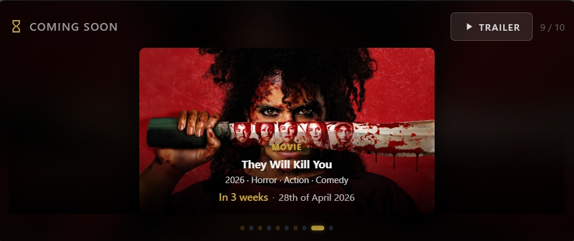
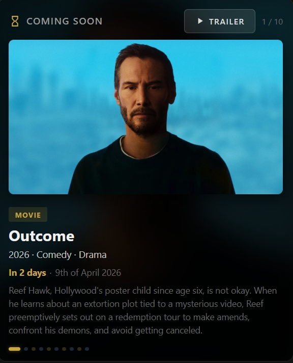
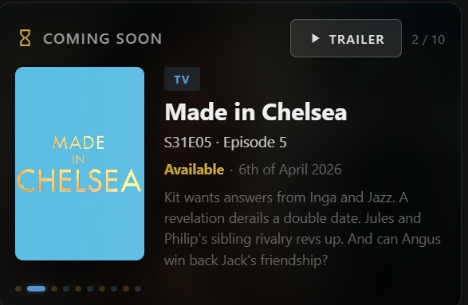

# Coming Soon Card

A cinematic Home Assistant card that displays upcoming movies and TV episodes from your [Radarr](https://radarr.video/) and [Sonarr](https://sonarr.tv/) libraries. Multiple layout options, countdown timers, release dates, swipe navigation, and trailer playback.

<p align="center">
  
</p>

## Features

- **Upcoming movies** from Radarr with digital release dates
- **Upcoming TV episodes** from Sonarr with air dates and season/episode numbers
- **Multiple layouts** — centred poster or detailed view with poster + info side-by-side
- **Image type toggle** — choose between poster art or key art/fanart
- **Countdown timer** — "In 5 days", "Tomorrow", "Today"
- **Formatted release date** — "8th of April 2026"
- **Swipe navigation** — swipe or click-and-drag left/right to move through items
- **Blurred background art** — cinematic fanart behind the card content
- **Trailer button** — plays trailers via TMDB (optional, requires free API key)
- **Auto-cycling** — rotates through upcoming items with smooth transitions
- **Color-coded dots** — gold for movies, blue for TV shows
- **Visual editor** — configure everything from the HA UI, no YAML needed
- **Responsive** — poster scales to fit any card width
- **Filters past releases** — only shows items with future release/air dates that haven't been downloaded yet
- **Deduplicates TV shows** — only shows the next upcoming episode per series, even if multiple episodes air the same day

---

## Layouts

### Poster (centred)
The default layout — poster front and centre with title, countdown, and release date overlaid at the bottom.

<p align="center">
  
</p>

### Detailed (poster + info)
Poster on the left with full details on the right — title, episode info, countdown, release date, and synopsis.

<p align="center">
  
</p>

### Key Art / Fanart
Switch from portrait poster art to landscape key art/fanart for a more cinematic look.

<p align="center">
  
</p>

---

## Install via HACS (Recommended)

1. Open **HACS** in Home Assistant
2. Click the **three dots** menu (top right) → **Custom repositories**
3. Paste `https://github.com/rusty4444/coming-soon-card` and select **Dashboard** as the category
4. Click **Add**
5. Search for **Coming Soon Card** in HACS → **Download**
6. Refresh your browser (Ctrl+Shift+R)

## Install Manually

1. Download `coming-soon-card.js` from the [latest release](https://github.com/rusty4444/coming-soon-card/releases)
2. Copy it to `/config/www/coming-soon-card.js`
3. Go to **Settings → Dashboards → Resources** and add:
   - URL: `/local/coming-soon-card.js`
   - Type: JavaScript Module
4. Refresh your browser

---

## Visual Editor

The card includes a built-in visual editor. When you add or edit the card, you'll see a graphical form instead of raw YAML.

You can still use YAML if you prefer — click "Show code editor" at the bottom of the editor.

---

## Configuration

Search for the card by name in the **Add Card** dialog — you can configure everything using the visual editor.

Or add a **Manual card** with this YAML:

```yaml
type: custom:coming-soon-card
radarr_url: http://YOUR_RADARR_IP:7878
radarr_api_key: YOUR_RADARR_API_KEY
sonarr_url: http://YOUR_SONARR_IP:8989
sonarr_api_key: YOUR_SONARR_API_KEY
movies_count: 5
shows_count: 5
cycle_interval: 8
title: Coming Soon
layout: poster
image_type: poster
tmdb_api_key: YOUR_TMDB_READ_ACCESS_TOKEN  # Optional: enables trailer button
```

### Options

| Option | Type | Default | Description |
|--------|------|---------|-------------|
| `radarr_url` | string | **Required** | Your Radarr server URL (e.g., `http://192.168.1.100:7878`) |
| `radarr_api_key` | string | **Required** | Your Radarr API key |
| `sonarr_url` | string | **Required** | Your Sonarr server URL (e.g., `http://192.168.1.100:8989`) |
| `sonarr_api_key` | string | **Required** | Your Sonarr API key |
| `movies_count` | number | `5` | Number of upcoming movies to display |
| `shows_count` | number | `5` | Number of upcoming TV episodes to display |
| `cycle_interval` | number | `8` | Seconds between cycling to the next item |
| `title` | string | `"Coming Soon"` | Header text (set to empty string to hide) |
| `layout` | string | `"poster"` | `poster` (centred poster with overlay) or `detailed` (poster + info side-by-side) |
| `image_type` | string | `"poster"` | `poster` (portrait poster art) or `fanart` (landscape key art/fanart) |
| `tmdb_api_key` | string | Empty (trailers disabled) | TMDB Read Access Token — enables the trailer button |
| `fill_height` | boolean | `true` | When enabled, card stretches to fill its container. Disable if the card appears collapsed |
| `card_height` | number | `300` | Card height in pixels (only used when `fill_height` is `false`) |

### Layout + Image Type combinations

| Layout | Image Type | Result |
|--------|-----------|--------|
| `poster` | `poster` | Centred portrait poster with info overlaid (default) |
| `poster` | `fanart` | Centred landscape fanart with info overlaid |
| `detailed` | `poster` | Poster left, info right — traditional media card look |
| `detailed` | `fanart` | Fanart on top, info below — cinematic widescreen look |

### Finding your API keys

**Radarr**: Settings → General → API Key

**Sonarr**: Settings → General → API Key

**TMDB** (optional, for trailers):
1. Create a free account at [themoviedb.org](https://www.themoviedb.org/signup)
2. Go to [API Settings](https://www.themoviedb.org/settings/api)
3. Copy the **Read Access Token** (not the API Key)

---

## Swipe Navigation

On touch devices, swipe left or right on the card to move through items. On desktop, click and drag left/right. The auto-cycle timer resets after each swipe.

---

## How It Works

The card fetches upcoming items from Radarr and Sonarr's calendar APIs (next 90 days), filters out anything already downloaded or with a past release date, then displays them in an alternating movie/show cycle with cinematic transitions.

- **Movies**: sorted by digital release date (soonest first)
- **TV Episodes**: sorted by air date (soonest first)
- Items are interleaved: movie, show, movie, show...

---

## Known Issues

- **Geo-restricted trailers**: Some trailers may show "Video unavailable — The uploader has not made this video available in your country." This is a YouTube/TMDB restriction and cannot be fixed by the card.

---

## Related

- [recently-added-media-card](https://github.com/rusty4444/recently-added-media-card) — Recently added movies and TV shows from Plex, Kodi, Jellyfin, or Emby

---

## Credits

Built for the Home Assistant community.
