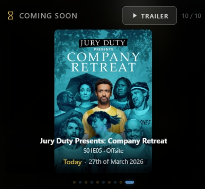
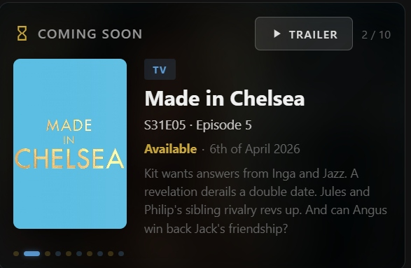
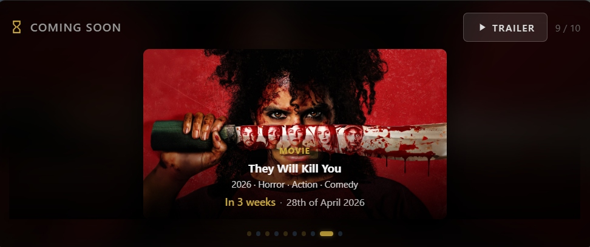
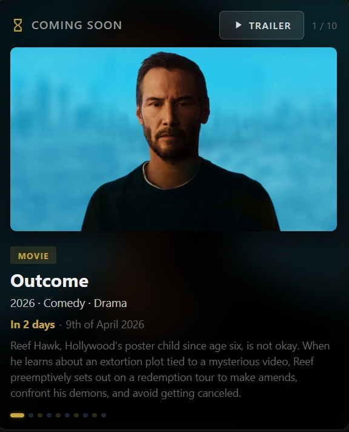

# Coming Soon Card

<p align="center">
  <a href="https://buymeacoffee.com/rusty4" target="_blank">
    
  </a>
</p>


A cinematic Home Assistant card that displays upcoming movies and TV episodes from **Radarr/Sonarr** and/or **Trakt**. Multiple layout options, themes, countdown timers, swipe navigation, and trailer playback.

<p align="center">
  
</p>

## Features

- **Multiple data sources** — Radarr + Sonarr, Trakt, or both combined
- **Upcoming movies** with digital release dates
- **Upcoming TV episodes** with air dates and season/episode numbers
- **Days offset** — optionally include items released up to N days ago
- **Themes** — 9 colour presets including Plex, Kodi, Jellyfin, Emby, Midnight, Sunset, Forest
- **Multiple layouts** — centred poster or detailed view with poster + info side-by-side
- **Image type toggle** — choose between poster art or key art/fanart
- **Countdown timer** — "In 5 days", "Tomorrow", "Today"
- **Formatted release date** — "8th of April 2026"
- **Swipe navigation** — swipe or click-and-drag left/right to move through items
- **Blurred background art** — cinematic fanart behind the card content
- **Trailer button** — plays trailers via TMDB (optional, requires free API key)
- **Trailer mode** — play inline on the card or as a fullscreen popup
- **Auto-cycling** — rotates through upcoming items with smooth transitions
- **Color-coded dots** — primary accent for movies, secondary for TV
- **Visual editor** — configure everything from the HA UI, no YAML needed
- **Responsive** — poster scales to fit any card width
- **Filters past releases** — only shows items not yet downloaded
- **Deduplicates TV shows** — only shows the next upcoming episode per series

---

## Layouts

### Poster (centred)
The default layout — poster front and centre with title, countdown, and release date overlaid at the bottom.

<p align="center">
  
</p>

### Detailed (poster + info)
Poster on the left with full details on the right — title, episode info, countdown, release date, and synopsis.

<p align="center">
  
</p>

### Key Art / Fanart
Switch from portrait poster art to landscape key art/fanart for a more cinematic look.

<p align="center">
  
</p>

### Detailed + Key Art
Combine detailed layout with fanart for a full info view with landscape key art.

<p align="center">
  
</p>

---

## Install via HACS (Recommended)

[](https://my.home-assistant.io/redirect/hacs_repository/?owner=rusty4444&repository=coming-soon-card&category=dashboard)

Or search for **Coming Soon Card** in HACS → **Download**.

## Install Manually

1. Download `coming-soon-card.js` from the [latest release](https://github.com/rusty4444/coming-soon-card/releases)
2. Copy it to `/config/www/coming-soon-card.js`
3. Go to **Settings → Dashboards → Resources** and add:
   - URL: `/local/coming-soon-card.js`
   - Type: JavaScript Module
4. Refresh your browser

---

## Visual Editor

The card includes a built-in visual editor. When you add or edit the card, you'll see a graphical form instead of raw YAML.

You can still use YAML if you prefer — click "Show code editor" at the bottom of the editor.

---

## Configuration

Search for the card by name in the **Add Card** dialog — you can configure everything using the visual editor.

Or add a **Manual card** with YAML (examples below).

### Radarr + Sonarr

```yaml
type: custom:coming-soon-card
radarr_url: http://YOUR_RADARR_IP:7878
radarr_api_key: YOUR_RADARR_API_KEY
sonarr_url: http://YOUR_SONARR_IP:8989
sonarr_api_key: YOUR_SONARR_API_KEY
movies_count: 5
shows_count: 5
cycle_interval: 8
title: Coming Soon
theme: auto
days_offset: 0
tmdb_api_key: YOUR_TMDB_READ_ACCESS_TOKEN  # Optional: enables trailers
```

### Trakt only

```yaml
type: custom:coming-soon-card
trakt_api_key: YOUR_TRAKT_CLIENT_ID
trakt_access_token: YOUR_TRAKT_ACCESS_TOKEN  # Optional: for private calendar
movies_count: 5
shows_count: 5
cycle_interval: 8
title: Coming Soon
tmdb_api_key: YOUR_TMDB_READ_ACCESS_TOKEN  # Optional: enables posters and trailers
```

### Trakt + Radarr/Sonarr combined

```yaml
type: custom:coming-soon-card
radarr_url: http://YOUR_RADARR_IP:7878
radarr_api_key: YOUR_RADARR_API_KEY
sonarr_url: http://YOUR_SONARR_IP:8989
sonarr_api_key: YOUR_SONARR_API_KEY
trakt_api_key: YOUR_TRAKT_CLIENT_ID
trakt_access_token: YOUR_TRAKT_ACCESS_TOKEN
movies_count: 5
shows_count: 5
tmdb_api_key: YOUR_TMDB_READ_ACCESS_TOKEN
```

---

### Options

| Option | Type | Default | Description |
|--------|------|---------|-------------|
| `radarr_url` | string | — | Radarr server URL (e.g., `http://192.168.1.100:7878`) |
| `radarr_api_key` | string | — | Radarr API key |
| `sonarr_url` | string | — | Sonarr server URL (e.g., `http://192.168.1.100:8989`) |
| `sonarr_api_key` | string | — | Sonarr API key |
| `trakt_api_key` | string | — | Trakt Client ID — enables Trakt calendar |
| `trakt_access_token` | string | — | Trakt OAuth access token, or a Home Assistant entity ID (e.g., `input_text.trakt_access_token`) that holds the token. See [Trakt Integration](#trakt-integration) for details |
| `movies_count` | number | `5` | Number of upcoming movies to display |
| `shows_count` | number | `5` | Number of upcoming TV episodes to display |
| `cycle_interval` | number | `8` | Seconds between cycling to the next item |
| `title` | string | `"Coming Soon"` | Header text — set to "Next Up" or any custom name |
| `theme` | string | `"auto"` | Colour theme — see [Themes](#themes) section |
| `layout` | string | `"poster"` | `poster` (centred) or `detailed` (poster + info side-by-side) |
| `image_type` | string | `"poster"` | `poster` (portrait art) or `fanart` (landscape key art) |
| `days_offset` | number | `0` | Include items released up to this many days ago (0 = future only) |
| `tmdb_api_key` | string | — | TMDB Read Access Token — enables posters (for Trakt) and trailers |
| `date_format` | string | `"ordinal"` | Date format for release/air dates — see table below |
| `trailer_mode` | string | `"popup"` | `popup` (fullscreen overlay) or `inline` (plays on top of card) |
| `show_trailer_button` | boolean | `true` | Show the trailer button in the card header. Set to `false` to hide it |
| `show_navigation` | boolean | `false` | Show prev/next arrow buttons for manual navigation through items |
| `loop_carousel` | boolean | `true` | Loop back to the first item after the last. Set to `false` for non-looping carousel with clear endpoints (works well with `show_navigation: true`) |
| `background_mode` | string | `"artwork"` | Card background: `artwork` (blurred fanart, default), `theme` (use HA theme background), or `transparent` (no background) |
| `fill_height` | boolean | `true` | Card stretches to fill container. Disable if card appears collapsed |
| `card_height` | number | `300` | Height in pixels when `fill_height` is `false` |

> **Tip:** For a manual-only browsing experience with clear start/end points, set `show_navigation: true`, `loop_carousel: false`, and a high `cycle_interval` (e.g., `999`).

At least one data source is required — either Radarr/Sonarr, Trakt, or both.

### Date Formats

| Value | Example | Description |
|-------|---------|-------------|
| `ordinal` | 10th of April 2026 | Default — most recognisable worldwide |
| `short` | 10 Apr 2026 | Compact international format |
| `us` | Apr 10, 2026 | US short format |
| `us_long` | April 10, 2026 | US long format |
| `eu` | 10/04/2026 | EU / Australian numeric format |
| `iso` | 2026-04-10 | ISO 8601 |

---

## Themes

The `theme` option controls the accent colours for badges, dots, countdown text, and highlights.

| Theme | Primary | Description |
|-------|---------|-------------|
| `auto` | Teal (#2dd4bf) | Default — neutral teal accent |
| `plex` | Gold (#e5a00d) | Plex's signature gold |
| `kodi` | Blue (#1da1f2) | Kodi blue |
| `jellyfin` | Purple (#aa5cc3) | Jellyfin purple |
| `emby` | Green (#52b54b) | Emby green |
| `dark` | Grey (#aaaaaa) | Neutral grey |
| `midnight` | Deep blue (#4f8ef7) | Midnight blue |
| `sunset` | Orange (#f97316) | Warm sunset tones |
| `forest` | Green (#22c55e) | Forest green |

---

## Trakt Integration

Trakt shows upcoming movies and TV episodes from your watchlist and followed shows.

### Getting a Trakt Client ID
1. Sign in at [trakt.tv](https://trakt.tv) and go to **Settings → Your API Apps**
2. Click **New Application**
3. Give it a name, set Redirect URI to `urn:ietf:wg:oauth:2.0:oob`, save
4. Copy the **Client ID** and paste it into `trakt_api_key`

### Getting a Trakt Access Token
The card uses Trakt's personal calendar endpoints, so Trakt calendar support needs an OAuth access token. A public Trakt profile does not remove this requirement.

**Option 1 — Home Assistant entity (recommended)**
Store the access token in a Home Assistant entity (e.g., an `input_text` helper or a sensor) and set `trakt_access_token` to the entity ID. The card resolves the token from Home Assistant state at fetch time and refetches when that entity value changes, so you can update the token without editing dashboard YAML.

```yaml
trakt_access_token: input_text.trakt_access_token
```

> **Tip:** Use [AppDaemon](https://appdaemon.readthedocs.io/) or a custom script to manage Trakt OAuth refresh tokens and publish the current access token to a Home Assistant entity.

**Option 2 — Static token**
1. Generate a Trakt access token through the [Trakt OAuth flow](https://trakt.docs.apiary.io/#reference/authentication-oauth)
2. Paste the resulting access token directly into `trakt_access_token`

Note: Static access tokens in dashboard YAML expire and need manual refresh. The entity-based approach (Option 1) is recommended for long-term use.

### How Trakt + TMDB works
Trakt doesn't provide images. When a TMDB API key is set, the card automatically fetches posters and fanart from TMDB for each Trakt item. Without a TMDB key, items will show a placeholder shimmer.

---

## Days Offset

The `days_offset` option lets you include items that came out recently but haven't been downloaded yet. For example:
- `days_offset: 0` — future only (default)
- `days_offset: 2` — includes anything released in the past 2 days
- `days_offset: 7` — look back a full week

---

## Layout + Image Type Combinations

| Layout | Image Type | Result |
|--------|-----------|--------|
| `poster` | `poster` | Centred portrait poster with info overlaid (default) |
| `poster` | `fanart` | Centred landscape fanart with info overlaid |
| `detailed` | `poster` | Poster left, info right — traditional media card look |
| `detailed` | `fanart` | Fanart on top, info below — cinematic widescreen look |

---

## Finding Your API Keys

**Radarr**: Settings → General → API Key

**Sonarr**: Settings → General → API Key

**TMDB** (for trailers and Trakt poster images):
1. Create a free account at [themoviedb.org](https://www.themoviedb.org/signup)
2. Go to [API Settings](https://www.themoviedb.org/settings/api)
3. Copy either the **API Read Access Token** (the long `eyJ...` token - recommended) **or** the **API Key (v3 auth)** (the 32-character hex string). From v1.2.2 the card auto-detects which one you've supplied.

> From v1.2.3, if the remote poster/fanart URL supplied by Radarr or Sonarr cannot be reached (e.g. blocked by Pi-hole, firewall, or unreachable on the client network), the card will automatically fall back to Radarr's/Sonarr's own cached copy at `/api/v3/MediaCover/{id}/poster.jpg`. No action required - it just works.

---

## Swipe Navigation

Swipe left or right on touch devices, or click-and-drag on desktop to move through items. The auto-cycle timer resets after each swipe.

---

## How It Works

- **Radarr/Sonarr**: fetches the calendar API for the next 90 days, filters out downloaded items, and sorts by release date
- **Trakt**: fetches your personal calendar for the next 90 days, enriches with TMDB images if a key is set
- When both sources are configured, results are merged and deduplicated by title
- Items are interleaved: movie, show, movie, show...

---

## Known Issues

- **Geo-restricted trailers**: Some trailers may show "Video unavailable — The uploader has not made this video available in your country." This is a YouTube/TMDB restriction and cannot be fixed by the card.

---

## Related

- [recently-added-media-card](https://github.com/rusty4444/recently-added-media-card) — Recently added movies and TV shows from Plex, Kodi, Jellyfin, or Emby

---

## Credits

- Built by Sam Russell — AI used in development
- YouTube embed fix based on the approach from [loryanstrant/ha-youtubevideocard](https://github.com/loryanstrant/ha-youtubevideocard) — YouTube IFrame API for Home Assistant
- Trailer data from [The Movie Database (TMDB)](https://www.themoviedb.org/)
- Built for the Home Assistant community
